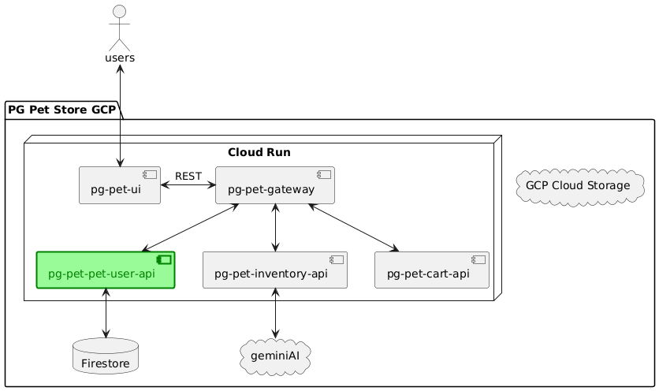

# SRE Support Manual for PgPetStore Pet-User API

🌟 Welcome to PG Pet Store: Where Every Pet’s Dream Comes True! 🐾

Hey there, pet lovers! Are you ready to embark on an exciting journey into the world of paws, claws, and adorable tails?
Introducing PG Pet Store, your brand new, one-stop shop for all things pet-centric! 🎉

Visit us at PG Pet Store and unleash the joy! Your pets will thank you! 🐕🐈🎈

## Overview

This manual provides a comprehensive guide for Site Reliability Engineers (SREs) to support and maintain the PgPetStore
Pet User API.
PgPetStore Pet User API is a Spring Boot microservice that is a small part of the PgPetStore system deployed as a Cloud
Run service in the Google Cloud Platform (GCP) environment.

## Architecture

- **Backend**: Spring Boot Microservices
- **Database**: PostgreSQL
- **Deployment**: GCP Cloud Run

## API Support Console

The API Support Dashboard is a dedicated page for support teams to debug and try the production application API. It
provides
various tools and information necessary for troubleshooting and managing the PgPetStore Pet-User API.

### Accessing the Support Console

You can access the Support Console at the following
URL: [Support Console](https://sre-workshop-pg-pet-store-917792339979.us-central1.run.app/swagger-ui/index.html#/)

## GCP Logging Console

The Logging Console is a dedicated page in Google Cloud Platform for support teams to access and analyze logs from the
production application. It
provides various tools and information necessary for troubleshooting and managing the PgPetStore Pet-User API.

### Accessing the GCP Logging Console

You can access the GCP Logging Console at the following
URL: [GCP Logging Console](https://console.cloud.google.com/run/detail/us-central1/sre-workshop-pg-pet-store/logs?project=testproject-244414)

### Features

- Log Access: View logs from the Cloud Run service.
- Filtering: Filter logs by severity, time, and other parameters.
- Search: Search for specific log entries using keywords.

## Incident Management

### Common Issues

1. **Service Unavailable**: Check Cloud Run service status and logs.
2. **Database Connectivity**: Verify database connection settings and network configurations.

### Steps to Resolve

1. **Identify the Issue**: Use Google Cloud Monitoring and Logging to identify the root cause.
2. **Check Service Health**: Verify the health of the Cloud Run service and dependent services.
3. **Review Logs**: Analyze logs in Google Cloud Logging for errors and warnings.
4. **Restart Service**: If necessary, escalate to admin for restarting the Cloud Run service from the GCP Console.

## Documentation

- **API Documentation**: Ensure API documentation is up-to-date and accessible.
- **Runbooks**: Maintain runbooks for common operational tasks and incident responses.

### Site Reliability Engineering (SRE)

Site Reliability Engineering (SRE) is a discipline that incorporates aspects of software engineering and applies them to
infrastructure and operations problems. The main goals are to create scalable and highly reliable software systems. SREs
are responsible for the availability, latency, performance, efficiency, change management, monitoring, emergency
response, and capacity planning of their services.

### Service Level Objectives (SLOs)

Service Level Objectives (SLOs) are specific measurable characteristics of the SLA such as availability, throughput,
frequency, response time, or quality. SLOs are used to define the target level of reliability for a service. They are
critical for maintaining a balance between releasing new features and ensuring the reliability of the service.

## Contact Information

- **Primary SRE Contact**: [Gosoco, Joswin Paolo, gosoco.jg@pg.com]
- **Secondary SRE Contact**: [Espelita, Jonah Jose, espelita.js@pg.com]
- **Escalation Path**: [Jon R. Moeller CEO]

This manual provides a comprehensive guide for SREs to support and maintain the PgPetStore application in a GCP Cloud
Run environment.
